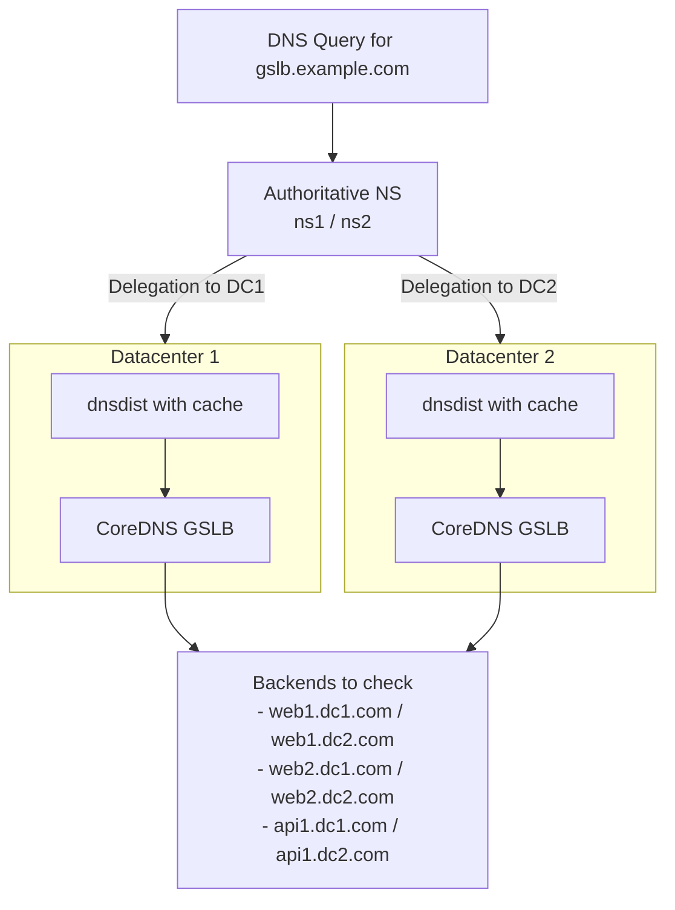
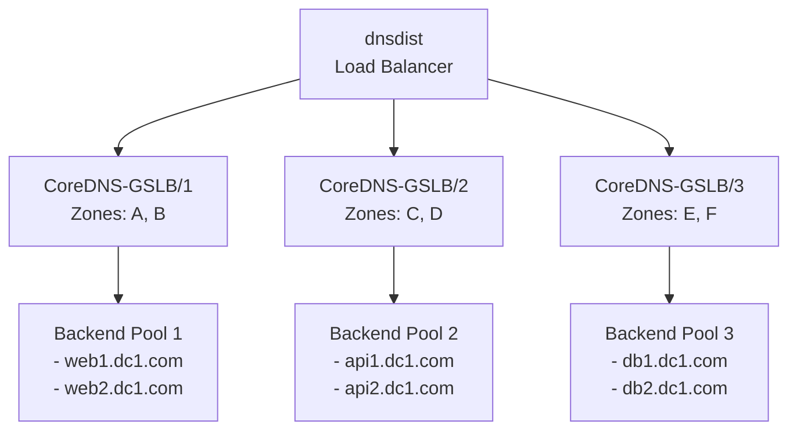
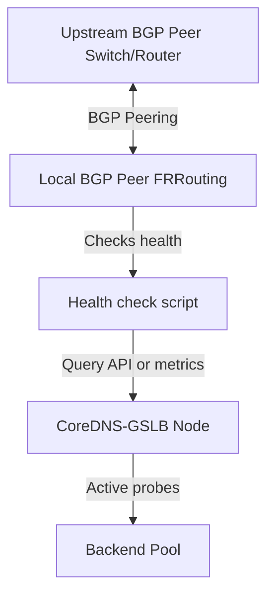

## CoreDNS-GSLB: Architecture

### High Availability and Scalability

For production environments requiring high availability and scalability, 
the CoreDNS-GSLB can be deployed as below to ensure resilience and performance

In this model:
  - Each CoreDNS-GSLB instance is deployed with the same configuration across datacenters.
  - All GSLB nodes monitor the same backend pool, ensuring consistent health-based decisions regardless of location.
  - GeoDNS logic (via EDNS Client Subnet and GeoIP) allows each instance to respond optimally from its point of view.



Per-Datacenter Scalability Model



**Benefits:**
- **Horizontal scalability**: Add more CoreDNS instances as needed
- **Zone isolation**: Each CoreDNS instance handles specific zones
- **Load balancing**: dnsdist distributes queries intelligently
- **Fault tolerance**: If one CoreDNS fails, others continue serving their zones
- **Resource optimization**: Each instance optimized for its zone workload

---

### Anycast Deployment & BGP Route Health Injection (RHI)

For maximum availability and sub-second failover of the CoreDNS-GSLB nodes themselves, you can deploy them using an **Anycast** IP address shared across multiple server nodes.

Instead of running BGP protocols directly inside the CoreDNS process—which is an anti-pattern due to security risks (binding privileged TCP port 179) and dependency bloat—the industry standard and production-grade best practice is to deploy a dedicated external routing service (like **FRRouting (FRR)**) alongside CoreDNS-GSLB. 

The local routing service acts as a **BGP peer** (or **BGP speaker**) that establishes a peering session with upstream BGP neighbors (switches/routers). It dynamically announces or withdraws the CoreDNS service IP (Anycast IP) based on the health status of the GSLB records.



#### Step 1: CoreDNS Prometheus Metrics Configuration

Ensure the Prometheus `metrics` plugin is active in your CoreDNS `Corefile` (usually listening on port `9153`):

```corefile
. {
    prometheus :9153
    gslb db.gslb.example.com.yml
}
```

This exposes GSLB metrics at `http://localhost:9153/metrics`. The key metric to watch is:
*   **`coredns_gslb_record_health_status`**: Exposes `1` if at least one backend is healthy (so the node should receive traffic), and `0` if all backends are down (so the node should withdraw itself).

#### Step 2: Route Health Injection (RHI) Script

A sample script is provided in the repository at [rhi/gslb-health.sh](../rhi/gslb-health.sh). This script queries the Prometheus metrics endpoint for CoreDNS-GSLB and returns `0` (success) if at least one backend is healthy, and `1` if all backends are down.

You can download and make this script executable on your host:
```bash
chmod +x rhi/gslb-health.sh
```

#### Step 3: Configure FRRouting (FRR)

A sample FRRouting configuration is provided in the repository at [rhi/frr.conf](../rhi/frr.conf).

In this setup:
1. You create a dummy network interface on the host (e.g., `dummy0`).
2. FRRouting is configured to peer with upstream BGP neighbors and advertise the Anycast IP address prefix (`192.168.100.10/32`) whenever it is present on the dummy interface.
3. The Route Health Injection script [rhi/gslb-health.sh](../rhi/gslb-health.sh) is run periodically (e.g., via a systemd timer or cron job).
   - If the GSLB is healthy, the script ensures the Anycast IP is assigned to the interface, triggering FRRouting to advertise the prefix to upstream peers.
   - If the GSLB is unhealthy, the script removes the IP from the interface, causing FRRouting to immediately withdraw the prefix.

By keeping routing logic separate from DNS logic, CoreDNS remains highly secure and lightweight while guaranteeing sub-second Anycast path convergence.


