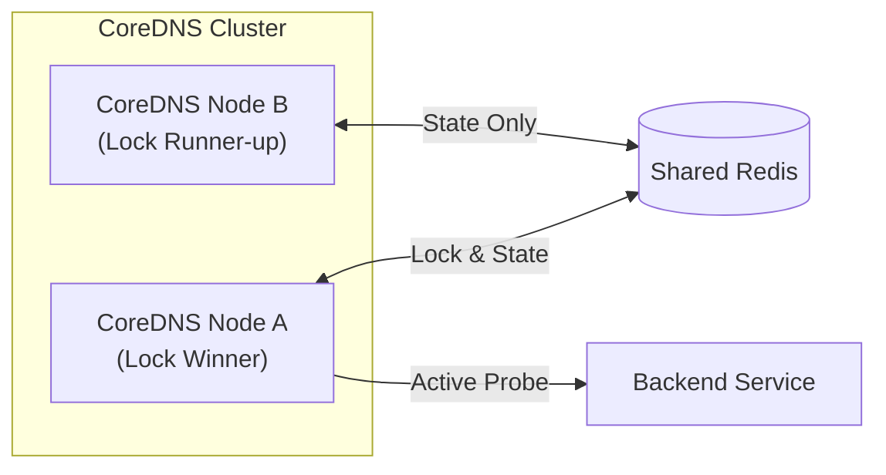
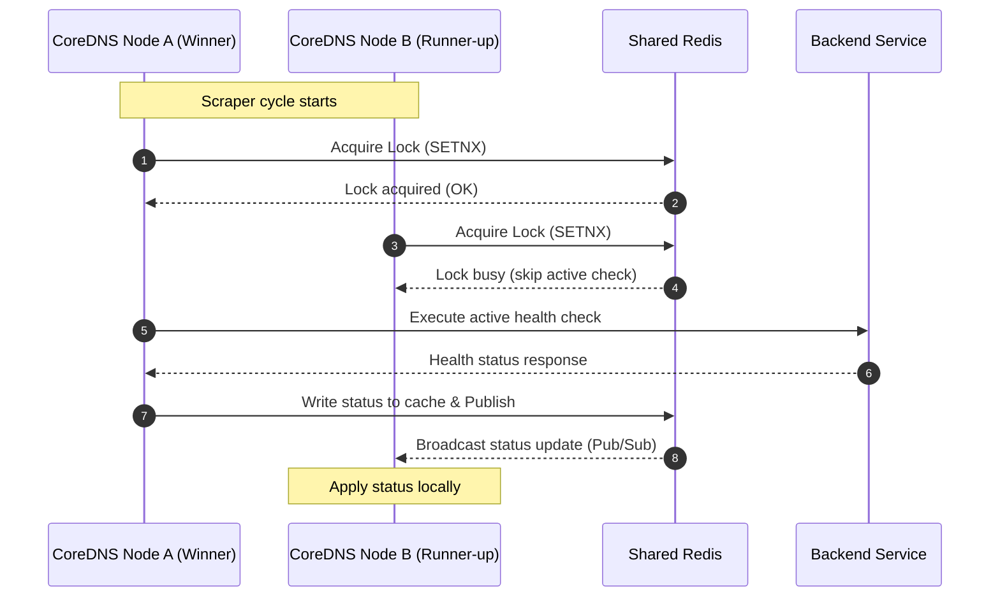

# Cluster Mode (Clustering)

CoreDNS-GSLB can be run in **Cluster Mode** using a shared Redis backend. This enables GSLB instances to coordinate active health checks, synchronize status changes in real-time, and support segmented network topologies.

*For step-by-step setup guides, refer to: [Cluster Mode Deployment Guide](deployments/clustering.md)*

!!! warning "Redis High Availability"
    Cluster Mode assumes that the shared Redis backend is itself highly available (e.g., deployed using Redis Sentinel or Redis Cluster). If Redis becomes unavailable, GSLB nodes will fall back to independent local check mode, and state synchronization will be temporarily lost.

### How Coordination Works

To coordinate check execution, CoreDNS-GSLB uses two views: a **structural topology** (who connects to what) and a **chronological sequence** (how lock coordination happens).

#### 1. Topology View
In this layout, only the instance that currently holds the lock for a backend performs active probing. The other instance completely bypasses probing and receives updates via Redis.

#### 2. Execution Sequence
The following sequence shows how the distributed lock prevents duplicate probes. 

> [!NOTE]
> **Simultaneous Requests & Atomicity**:
> If two instances attempt to acquire the lock at the exact same millisecond, Redis's single-threaded command execution guarantees atomicity. The first `SETNX` request to arrive will succeed, and the second will instantly fail, ensuring that exactly one node performs the check.

---

## Capabilities

### Distributed Scraper Deduplication
When running multiple GSLB instances in a cluster, having every instance probe every backend can generate excessive traffic and overwhelm your servers.
With synchronization enabled, GSLB nodes coordinate so that **only one instance** performs the active health check for a given backend. The result is saved in the shared Redis cache, and all other instances use this status directly without sending duplicate probes.

### Backend Status Propagation
Whenever a backend health status change is detected, the change is immediately broadcast to all other GSLB instances. Other nodes apply the state transition to their local routing table in real-time (within milliseconds), ensuring global routing consistency.

### Cold-Start Prevention
Upon startup, a GSLB instance fetches the current health status of all backends from Redis. This prevents "cold-start" routing inconsistency while the local checks execute their first cycle.

### Fail-Open Resiliency
If the shared Redis server becomes unreachable, GSLB instances automatically fall back to independent local active health checking. Once Redis is restored, they seamlessly rejoin the shared cluster.

---

## Cluster Scaling & Limits

CoreDNS-GSLB's Cluster Mode is highly optimized and has **no hard limits** on the number of CoreDNS instances. A single, standard Redis instance can comfortably support **hundreds of GSLB nodes** monitoring thousands of backends.

### Scaling Factors
* **Connection Capacity**: Each CoreDNS instance opens a small connection pool for commands and one persistent connection for Pub/Sub. Since a standard Redis instance easily handles 10,000+ concurrent client connections by default, connection limits are rarely a bottleneck.
* **CPU & Memory Overhead**: GSLB stores minimal state in Redis (just a few bytes per backend for health status). CPU load remains very low because of **Scraper Deduplication**: only the lock-winning node writes to Redis and publishes updates, keeping write operations to a minimum ($M / T$ where $M$ is the number of backends and $T$ is the scrape interval).
* **Network & Latency**: The primary factor to watch in large or geo-distributed deployments is network latency between GSLB instances and Redis. If Redis latency exceeds the command timeout, nodes will fall back to local independent checks until connectivity is restored.
