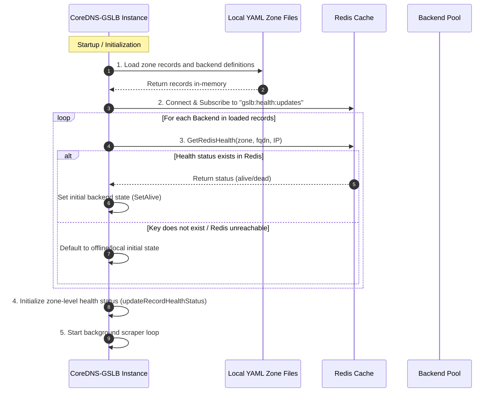
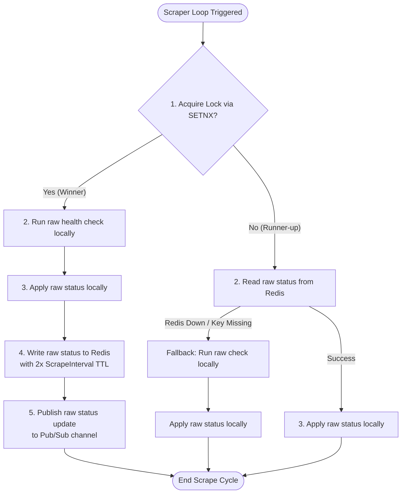
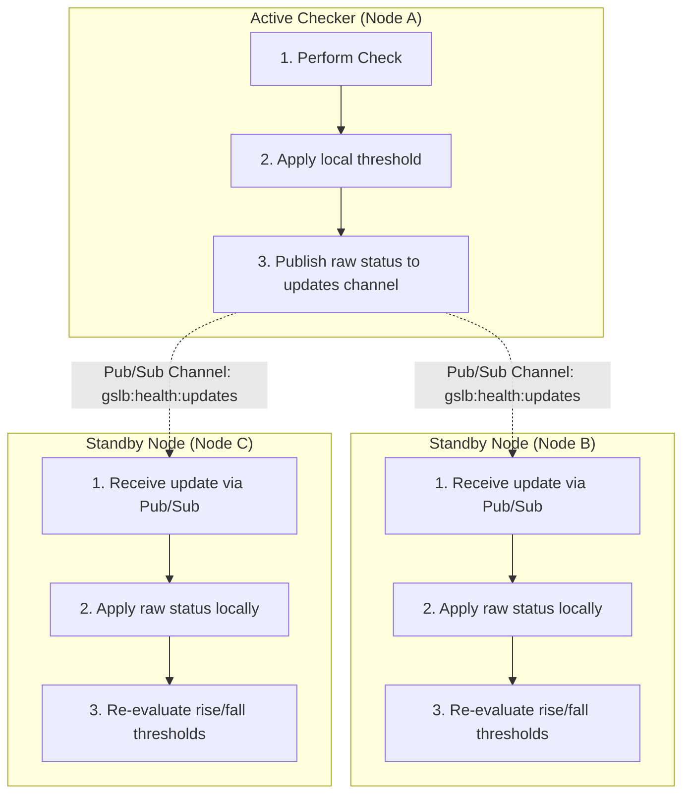

# Cluster Mode Deployment

In highly available (HA) deployments with multiple CoreDNS-GSLB instances, executing health checks independently from every instance can put redundant load on backends and lead to temporary DNS answer inconsistencies.

CoreDNS-GSLB features a **Cluster Mode** backed by a shared Redis database to solve this.

---

## Startup Sequence

When a CoreDNS-GSLB instance starts up, it aligns its in-memory status with the shared Redis state immediately to avoid cold-start issues or temporary routing discrepancies.



---

## Runtime Check Execution (Distributed Lock Mode)

At each scraping interval, CoreDNS-GSLB instances coordinate check execution via distributed locks (`SETNX`) to ensure only one instance executes a health check per cycle.



---

## State & Threshold Synchronization (Pub/Sub)

To guarantee that all instances apply rise/fall state machine transitions consistently, instances publish and consume **raw health check results** (before applying threshold logic). Each instance then runs the threshold state machine locally on every update.



---

## Configuration

To enable Cluster Mode, configure the Redis options inside the `gslb` block of your `Corefile`. 

For a comprehensive description of all configuration options, refer to the [Corefile Reference](../configuration.md#redis-cluster-mode-options) guide.

### Corefile Example

```nginx
gslb {
    # ... other options ...

    # Enable Redis sync (default: false)
    redis_enable true

    # Redis address (default: "127.0.0.1:6379")
    redis_addr "redis-server.local:6379"

    # Redis password (default: "")
    redis_password "securepass"

    # Redis database number (default: 0)
    redis_db 0

    # Key prefix to namespace Redis keys (default: "gslb:")
    redis_key_prefix "gslb:"

    # Sync mode (default: "lock"). Use "none" to disable distributed locking
    redis_sync_mode "lock"
}
```

---

## Resilience & Failover Modes

- **Redis Unreachable**: If the connection to Redis fails during startup or execution, the GSLB plugin logs the warning and automatically switches to **independent local check mode**.
- **Lock Owner Death**: Locks are acquired with a short Time-To-Live (TTL) equal to `scrapeInterval / 2` (minimum 2s). If an instance dies mid-check, the lock naturally expires and another instance will automatically assume check execution during the next cycle.
