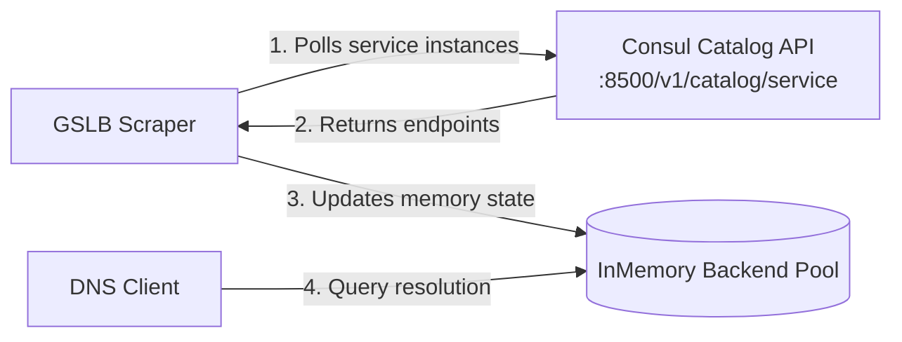

# Consul Integration Guide

CoreDNS-GSLB dynamically integrates with HashiCorp Consul to automate backend discovery. Rather than manually updating zone configuration files when backend instances scale or fail, CoreDNS-GSLB queries Consul's service catalog API at regular intervals to dynamically update the backend pool.

## How it Works



1. **Scraping**: CoreDNS-GSLB periodically polls the Consul Catalog API for the configured service.
2. **Delegated Health Status**: Consul is the system of record performing the active health checks on the services. It only returns service instances that are present in the catalog.
3. **Dynamic Update**: The backend pool is updated in memory. Discovered backends are assumed to be healthy by CoreDNS-GSLB, bypassing local active probing to save resources.
4. **Resolution**: DNS queries are answered using only the retrieved healthy backends from Consul.

## Configuration

Consul discovery is configured per-record inside your GSLB zone YAML file under the `discovery` block.

### Example YAML Configuration

```yaml
records:
  api.example.org.:
    mode: "roundrobin"
    discovery:
      type: "consul"
      endpoint: "http://consul.internal:8500"
      service: "payment-api"
      tag: "production"  # Optional tag filter
      interval: "10s"
```

### Configuration Parameters

| Parameter | Type | Required | Description |
|---|---|---|---|
| `type` | string | **Yes** | Must be set to `"consul"`. |
| `endpoint` | string | **Yes** | The HTTP URL of the Consul catalog API (e.g., `http://localhost:8500`). |
| `service` | string | **Yes** | The name of the service registered in Consul. |
| `tag` | string | No | Optional tag to filter service instances (e.g., `"v2"` or `"production"`). |
| `interval` | duration | No | The interval between scrap queries (default: `"10s"`, e.g., `"5s"`, `"1m"`). |

## Consul Response Mapping

CoreDNS-GSLB queries the Consul HTTP API endpoint:
```
{endpoint}/v1/catalog/service/{service}[?tag={tag}]
```

The response is mapped as follows:

- **IP Address**: Extracted from `"ServiceAddress"`. If `"ServiceAddress"` is empty, it falls back to `"Address"` (the node address).
- **Port**: Extracted from `"ServicePort"`.
- **Weight / Priority**: Defaults to `10` and `1` respectively.

This allows seamless integration with both standard Consul setups and Nomad/Kubernetes-managed Consul registries.
