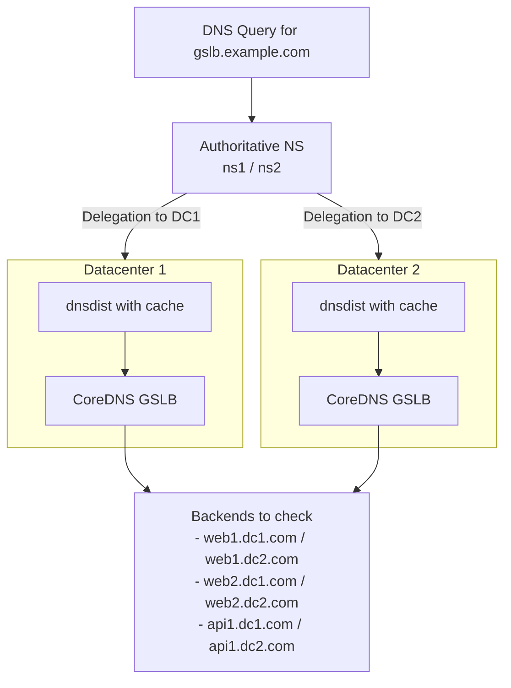
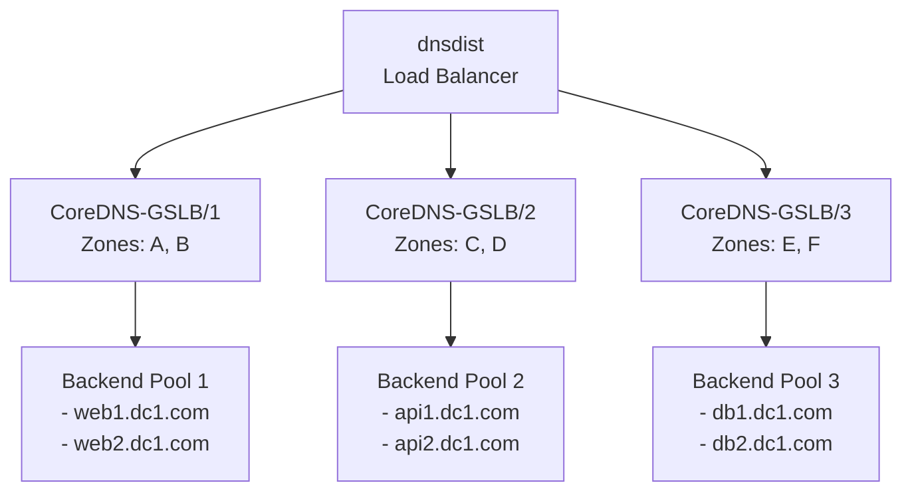

# Standalone Deployments

For production environments, CoreDNS-GSLB can be deployed across multiple datacenters or nodes. 

Without a shared backend (like Redis), each GSLB instance runs as an **independent, standalone node**. Each node performs its own active health checks and maintains its own in-memory routing state independently.

## Datacenter Redundancy Model (Standalone Nodes)

In this model:

- Each CoreDNS-GSLB instance is deployed with the same configuration across datacenters.
- All GSLB nodes monitor the same backend pool, ensuring consistent health-based decisions regardless of location.
- GeoDNS logic (via EDNS Client Subnet and GeoIP) allows each instance to respond optimally from its point of view.

## Per-Datacenter Scalability Model (Standalone Nodes)

To scale queries within a single datacenter, you can load-balance multiple CoreDNS-GSLB instances using a frontend DNS load balancer like `dnsdist`.

### Key Benefits

*   **Horizontal Scalability**: Add more CoreDNS instances as query volume increases.
*   **Zone Isolation**: Segment your DNS architecture by configuring instances to handle specific zones.
*   **Load Balancing**: `dnsdist` distributes queries intelligently and caches frequent responses.
*   **Fault Tolerance**: If one CoreDNS instance fails, other instances or backend paths continue serving workloads.
*   **Resource Optimization**: Each instance is optimized for its specific zone workload and backend monitoring pool.
