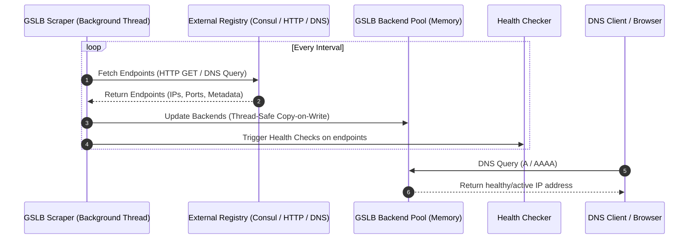

# Service Discovery & Backend Discovery

CoreDNS-GSLB allows you to build and manage backend pools using three distinct approaches: static configuration, dynamic management via the REST API, or dynamic Service Discovery from external catalogs and DNS endpoints.

---

## 1. Backend Pool Options

| Method | Type | Description |
|---|---|---|
| **Static Configuration** | File-based | Configured directly in the zone YAML files. Best for stable, fixed backend pools. |
| **REST API** | Dynamic | Managed via HTTP REST endpoints (bulk PUT/POST operations). Best for CI/CD integrations. |
| **Service Discovery** | Dynamic / External | Dynamically fetched from external service registries (Consul, HTTP endpoints, or DNS SVCB/HTTPS records). |

---

## 2. Static Configuration

Static configurations are defined under the `backends` block of a record in your zone files.

```yaml
records:
  web.example.org.:
    mode: "roundrobin"
    backends:
      - address: "192.168.1.10"
        port: 80
        weight: 10
        priority: 1
      - address: "192.168.1.11"
        port: 80
        weight: 10
        priority: 1
```

---

## 3. Dynamic Management via REST API

You can enable the REST API server to dynamically register, update, or remove backends. This is useful for automated pipelines or external monitoring tools.

### Corefile Configuration:

```
gslb {
    api_enable true
    api_listen_addr 0.0.0.0
    api_listen_port 8080
}
```

### Endpoints:
- `PUT /api/v1/zones/{zone}/records/{fqdn}/backends`: Overwrite the backend pool for a specific record.
- `GET /api/v1/status`: View all configured records, backends, and their health statuses.

---

## 4. Dynamic Service Discovery

CoreDNS-GSLB can query external registries at a regular interval to dynamically refresh its backend pool, enabling zero-touch configuration.

### How it Works (Flow Diagram)




### A. Consul Catalog Discovery

Fetches services from the Consul Catalog API.

#### Configuration Example:
```yaml
records:
  api.example.org.:
    mode: "roundrobin"
    discovery:
      type: "consul"
      endpoint: "http://localhost:8500"
      service: "web-service"
      interval: "10s"
```

#### Consul JSON Response Mapping:
CoreDNS-GSLB maps the `"ServiceAddress"` (or `"Address"` if empty) and `"ServicePort"` parameters returned from `/v1/catalog/service/{service}`.

---

### B. HTTP Discovery

Queries a custom HTTP JSON endpoint returning either a list of IP address strings or a list of structured backend objects.

#### Configuration Example:
```yaml
records:
  api.example.org.:
    mode: "roundrobin"
    discovery:
      type: "http"
      endpoint: "http://my-registry.internal/endpoints"
      interval: "15s"
```

#### Supported JSON Structures:
1. **Simple List of IP Strings:**
   ```json
   ["10.0.0.1", "10.0.0.2"]
   ```
2. **Detailed Backend Objects:**
   ```json
   [
     {"address": "10.0.0.1", "port": 8080},
     {"address": "10.0.0.2", "port": 8081}
   ```

---

### C. Upstream DNS Discovery (SVCB & HTTPS Records)

Queries upstream DNS servers for `SVCB` or `HTTPS` records (RFC 9460). It parses target hosts, port numbers, ALPN support lists, and IP address hints (`ipv4hint` / `ipv6hint`) to build the backend pool. If no hints are returned but a target is set, it issues fallback `A` / `AAAA` queries to resolve the target domain's IP addresses.

#### Configuration Example:
```yaml
records:
  secure.example.org.:
    mode: "roundrobin"
    discovery:
      type: "svcb"  # Or "https"
      endpoint: "10.0.0.10:53"
      service: "_https._tcp.secure.internal."
      interval: "30s"
```

---

## 5. SVCB and HTTPS Record Responses (RFC 9460)

When client browsers query CoreDNS-GSLB for `SVCB` or `HTTPS` records directly, it constructs RFC 9460-compliant DNS messages containing:
- **Port**: The backend's specific port.
- **ALPN**: Configurable protocols (e.g. `h3`, `h2`) announced using `svcb_alpn`.
- **IP Hints**: Live IPv4 and IPv6 addresses of healthy backends.

This allows modern browsers to negotiate TLS, ALPN protocols, and resolve IP addresses in a single round-trip query.

#### Record Configuration Example:
```yaml
records:
  web.example.org.:
    mode: "roundrobin"
    svcb_alpn: ["h3", "h2"]
    backends:
      - address: "192.168.1.10"
        port: 443
      - address: "192.168.1.11"
        port: 8443
```
