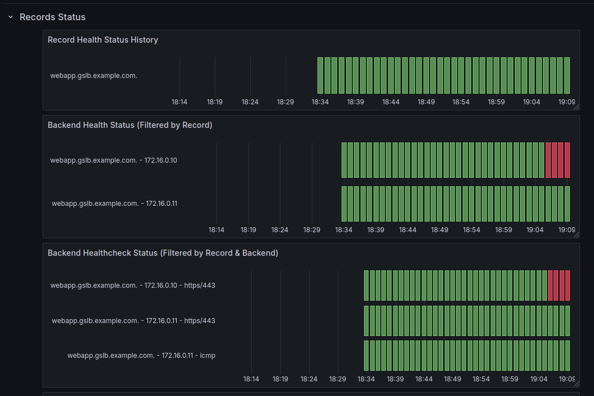

## CoreDNS-GSLB: Observability

### Metrics

If you enable the `prometheus` block in your Corefile, the plugin exposes the following metrics on `/metrics` (default port 9153):

Enable in Corefile:
```
. {
    prometheus
    ...
}
```

Available metrics:

| Metric Name                                 | Labels                                             | Description                                                                                     |
|--------------------------------------------|----------------------------------------------------|-------------------------------------------------------------------------------------------------|
| `gslb_healthcheck_total`                   | `name`, `type`, `address`, `result`                | Total number of healthchecks performed.                                                        |
| `gslb_healthcheck_duration_seconds`        | `type`, `address`                                  | Duration of healthchecks in seconds.                                                           |
| `gslb_healthcheck_failures_total`          | `type`, `address`, `reason`                        | Total number of healthcheck failures. `reason` can be: `timeout`, `connection`, `protocol`, `other`.                                 |
| `gslb_record_resolution_total`             | `name`, `result`                                   | Total number of GSLB record resolutions.                                                       |
| `gslb_record_resolution_duration_seconds`  | `name`, `result`                                   | Duration of GSLB record resolution in seconds.                                                 |
| `gslb_record_health_status`                | `name`, `status`                                 | Health status per record (1 = healthy, 0 = unhealthy).                                         |
| `gslb_backend_health_status`               | `name`, `address`, `status`                     | Health status per backend (1 = healthy, 0 = unhealthy).                                        |
| `gslb_backend_healthcheck_status`          | `name`, `address`, `type`, `status`             | Healthcheck status per backend and type (1 = success, 0 = fail).                               |
| `gslb_config_reload_total`                 | `result`                                           | Total number of config reloads.                                                                |
| `gslb_backend_active`                      | `name`                                             | Number of active (healthy) backends per record.                                                |
| `gslb_backend_selected_total`             | `name`, `address`                                  | Total number of times a backend was selected for a record.                                     |
| `gslb_healthchecks_total`                  | *(none)*                                         | Number of healthchecks configured (total for all records/backends).                            |
| `gslb_backends_total`                      | *(none)*                                         | Total number of backends configured (all records).                                             |
| `gslb_records_total`                       | *(none)*                                         | Total number of GSLB records (FQDNs) configured.                                               |
| `gslb_version_info`                        | `version`                                          | GSLB build version info (always set to 1).                                                     |

You can then scrape metrics at http://localhost:9153/metrics

Dashboard example


