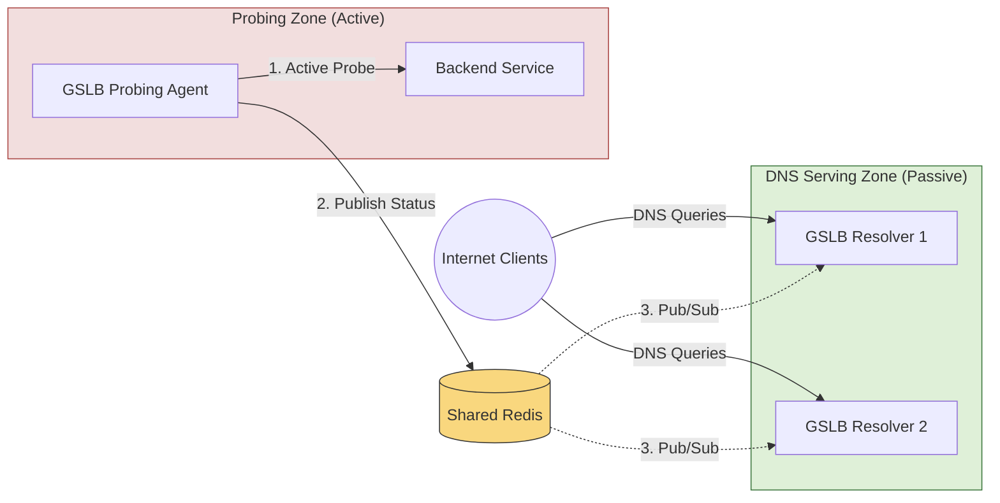

# Offloaded Probing

Offloaded Probing allows you to separate the role of **DNS serving** from **health check execution**. 

Instead of forcing every CoreDNS-GSLB instance to perform active network probes, you can configure instances to run in **passive mode**. Passive instances do not perform any active health checks; they simply listen for health status updates via Redis and serve DNS queries from memory.

*For step-by-step setup guides, refer to: [Offloaded Probing Deployment Guide](deployments/offloaded.md)*

---

## Core Use Cases

### Separation of Concerns (Checking vs. Serving)
In high-traffic production environments, you can isolate health-checking overhead (CPU, sockets, network bandwidth) from your critical DNS resolution path. 
* **DNS Resolver Nodes (Passive)**: Configured with `passive: true`. They consume zero network bandwidth and CPU for health check loops, ensuring maximum performance and stability for resolving queries.
* **Probing Agent Nodes (Active)**: Dedicated, lightweight GSLB instances tasked solely with running health check loops and writing results to Redis.

### Segmented Networks (Security & Firewalls)
In restricted topologies, GSLB instances exposed to public client DNS queries may not have direct network access to backends running inside isolated private subnets or behind strict firewalls.
By deploying a GSLB probing agent inside the private subnet, it can monitor local backends and publish updates to a shared Redis, allowing the public GSLB instances to route traffic dynamically without needing direct network access.

---

## Architectural Overview

- **GSLB Resolver Nodes (Passive)**: Exposed to clients for DNS resolution. They do not perform network health checks (`passive: true`) and subscribe to Redis Pub/Sub to receive updates.
- **GSLB Probing Agent (Active)**: Deployed inside the backend network. It does not resolve client queries (no public DNS listener) but actively monitors local backends and writes their status to Redis.
- **Shared Redis Server**: Acts as the communication bridge, propagating health updates from the probing agent to the passive resolvers in real-time.

## Benefits of Offloaded Probing

1. **Resource Optimization**: DNS resolver nodes do not execute any network health probes or run checking threads, ensuring maximum query throughput, low memory footprint, and high stability.
2. **Security**: Public GSLB instances require no firewall rules or direct routing access to reach protected backend subnets.
3. **Bandwidth Savings**: Active health check probing traffic is isolated to the probing network/agent.
4. **Resilience**: Real-time Pub/Sub propagation ensures passive resolver nodes apply state transitions within milliseconds of detection by the active prober.
