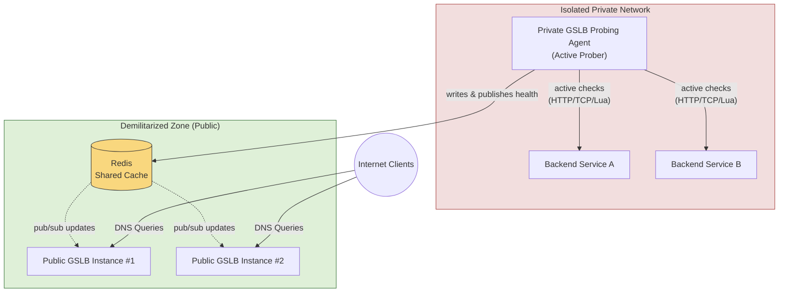

# Segmented Passive Monitoring

In segmented network architectures, GSLB instances exposed to public client DNS queries may not have direct network access to backend services running in isolated subnets, private clouds, or behind strict firewalls. 

Using the **Passive Backend Monitoring** feature alongside Cluster Mode, you can deploy a dedicated, internal GSLB instance to perform active checks and publish results to a shared Redis, allowing the public GSLB instances to route traffic dynamically without ever probing the backends directly.

---

## Architectural Overview

- **Public GSLB Instances**: Exposed to clients for DNS resolution. They do not perform network health checks for isolated backends (`passive: true`). They subscribe to Redis Pub/Sub to receive health updates.
- **Private GSLB Probing Agent**: Deployed inside the isolated network. It does not resolve client queries (no public DNS listener) but actively monitors the local backends and writes their health status to Redis.
- **Shared Redis Server**: Acts as the communication bridge, propagating health updates from the probing agent to the public resolvers in real-time.



---

## Configuration Example

### 1. Public GSLB Configuration (`Corefile`)

Configure the GSLB instances with Redis enabled:

```nginx
gslb {
    zone app.example.org. /etc/coredns/db.app.yml
    redis_enable true
    redis_addr "redis.shared.local:6379"
    redis_password "securepass"
    redis_sync_mode lock
}
```

In the zone YAML file (`/etc/coredns/db.app.yml`), mark the backends inside the isolated network as **passive**:

```yaml
records:
  api.example.org.:
    mode: failover
    backends:
      - address: "10.0.1.10"
        priority: 1
        passive: true   # Will NOT run local probes, reads from Redis
      - address: "10.0.1.11"
        priority: 2
        passive: true   # Will NOT run local probes, reads from Redis
```

---

### 2. Private Probing Agent Configuration

Configure the probing agent to connect to the same Redis instance:

```nginx
gslb {
    zone app.example.org. /etc/coredns/db.app.yml
    redis_enable true
    redis_addr "redis.shared.local:6379"
    redis_password "securepass"
    redis_sync_mode lock
}
```

In its local zone YAML file, configure the backends with **active health checks**:

```yaml
healthcheck_profiles:
  http_check:
    type: http
    params:
      port: 80
      uri: "/healthz"

records:
  api.example.org.:
    mode: failover
    backends:
      - address: "10.0.1.10"
        priority: 1
        healthchecks: [ http_check ] # Actively supervised locally
      - address: "10.0.1.11"
        priority: 2
        healthchecks: [ http_check ] # Actively supervised locally
```

---

## Benefits of Segmented Passive Monitoring

1. **Security**: Public GSLB instances require no firewall rules to access private backend networks.
2. **Bandwidth Savings**: Health check traffic is contained locally within the isolated subnet.
3. **Resilience**: Real-time Pub/Sub propagation ensures public resolvers apply state transitions within milliseconds of detection by the private agent.
