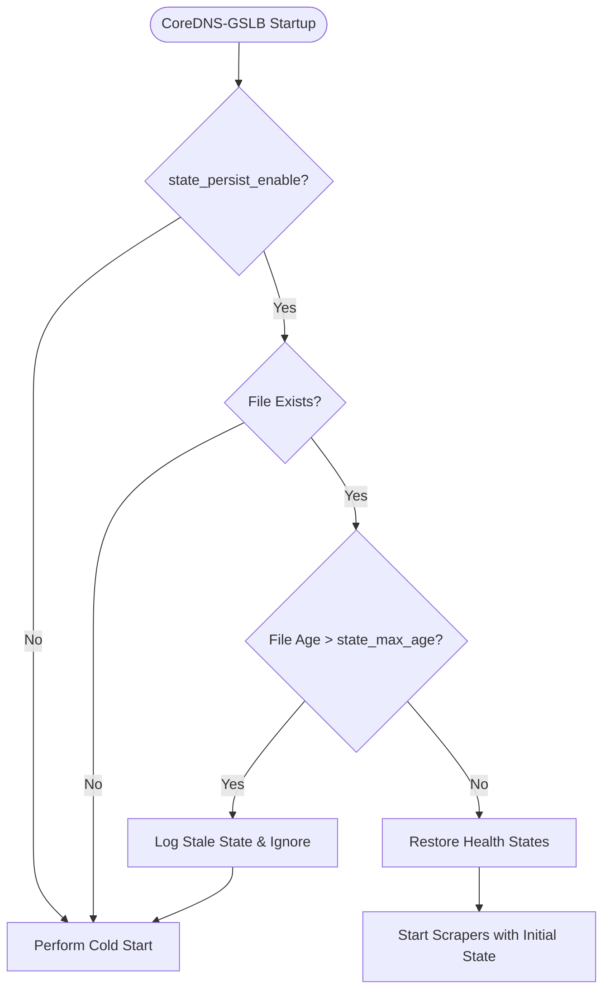

# Local State Persistence

CoreDNS-GSLB can persist backend health status and last resolution times locally on disk in **Standalone Mode**. This feature prevents "cold-start" routing inconsistency during standalone restarts (such as crash recoveries, deployments, or Corefile reloads).

*For a step-by-step setup guide, refer to the [Corefile Reference](configuration.md#standalone-state-persistence-options-standalone-mode-only).*

!!! note "Standalone Mode Only"
    This feature is only active when **`redis_enable` is set to `false`**. When Cluster Mode (via Redis) is enabled, local disk persistence is ignored as Redis acts as the centralized, persistent source of truth.

---

### How State Persistence Works

When CoreDNS-GSLB restarts or reloads its configuration, all backend health records stored in memory are normally reset. This causes a "cold start" where GSLB must rebuild its view of backend health from scratch before making routing decisions.

Local state persistence solves this by periodically taking snapshots of the health state and restoring them at startup.

#### 1. Lifecycle and State Restoration

During startup, if local state persistence is enabled and a valid state file exists:
1. GSLB reads the state file from the configured `state_persist_path`.
2. It parses the JSON state and verifies the file's modification time.
3. If the file is older than `state_max_age`, it is ignored as stale to prevent using outdated health state.
4. If it is within the allowed age, GSLB applies the saved statuses (`healthy` or `unhealthy`), last check times, and last resolution times to the in-memory backends.
5. Background health scrapers start immediately using these restored states as their initial baseline.



#### 2. Periodic Saving and Shutdown

While running, GSLB periodically saves its state at the interval specified by `state_persist_interval`. To prevent data corruption, GSLB performs **atomic writes** by writing to a temporary file first, then renaming it to the final destination path.

When CoreDNS reloads or shuts down, GSLB intercepts the shutdown hook, cancels the periodic save loop, and flushes the final health status to disk immediately.

---

### File Schema

The state is stored in a clean, human-readable JSON format. Each key consists of the backend's FQDN and IP address separated by a pipe (`|`):

```json
{
  "webapp.example.com.|172.16.0.10": {
    "status": "healthy",
    "last_check": "2026-07-07T09:00:00Z",
    "last_resolution": "2026-07-07T08:58:30Z"
  },
  "webapp.example.com.|172.16.0.11": {
    "status": "unhealthy",
    "last_check": "2026-07-07T09:00:05Z",
    "last_resolution": "2026-07-07T08:50:00Z"
  }
}
```

---

### Configuration Example

Add the following directives inside the `gslb` block of your Corefile:

```corefile
gslb {
    zone example.com. /etc/coredns/db.example.com.yml

    # Enable local state persistence
    state_persist_enable true
    state_persist_path "/var/lib/coredns-gslb/state.json"
    state_persist_interval "30s"
    state_max_age "60s"
}
```
